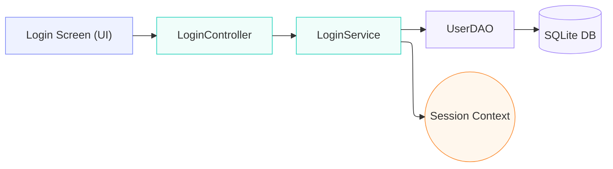
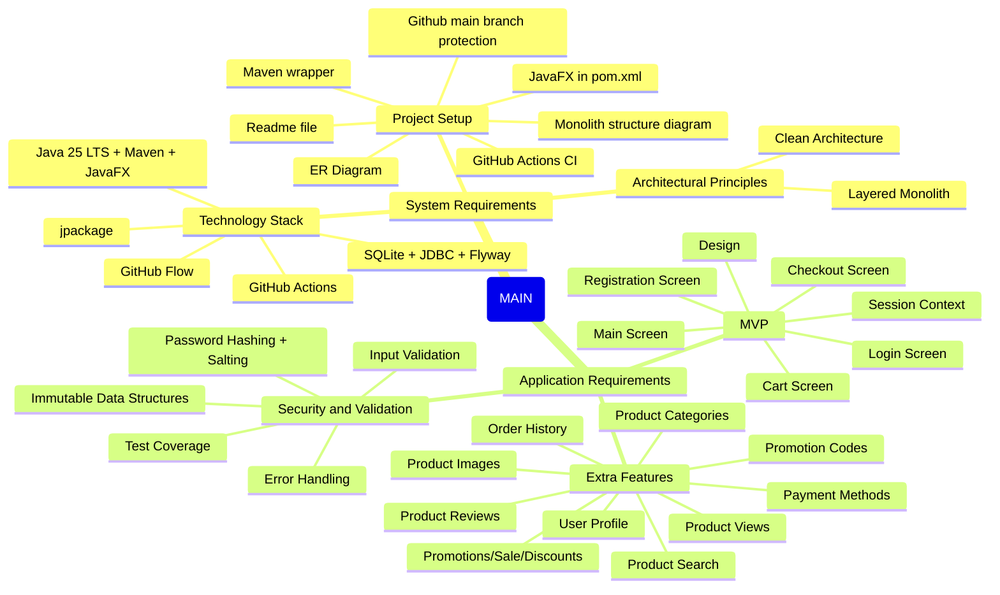
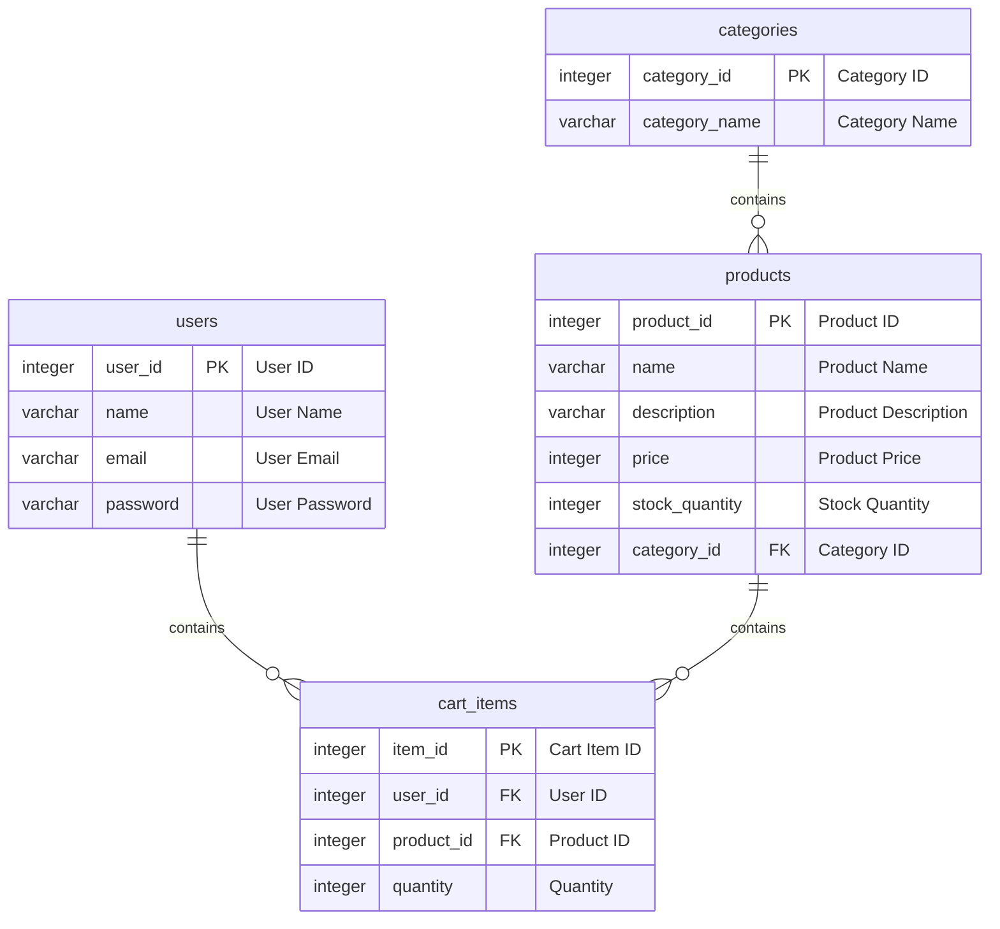
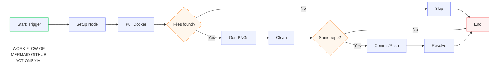

# Architecture Diagrams

> This document contains the architectural diagrams of the project. It is intended to provide a visual representation of the architecture and design of the project. It is not meant to be a detailed technical document, but rather a high-level overview of the architecture and design decisions made during the development of the project.
> The diagrams are created using Mermaid, a simple markdown-like syntax for generating diagrams and flowcharts. The diagrams are included in the documentation to help developers understand the architecture and design of the project, and to provide a reference for future development and maintenance.

## Mermaid Diagrams

1. Simple Application Flow
   - This diagram illustrates the flow of the application, showing how the different layers (UI, Controller, Service, DAO, Model) interact with each other and with the database.

2. Checklist Mind Map
   - This diagram represents the checklist of architectural and design considerations that were taken into account during the development of the project. It serves as a reminder of the key principles and best practices that guided the architectural decisions.

3. ERD v1
   - This diagram shows the Entity-Relationship Diagram (ERD) of the database schema, illustrating the tables, their attributes, and the relationships between them.

4. Mermaid GHA Workflow Diagram
   - This diagram represents the GitHub Actions workflow for the CI/CD pipeline, showing the different jobs and steps that are executed when code is pushed to the repository.

Refer to .github/workflows/ci.yml for the actual workflow file.

